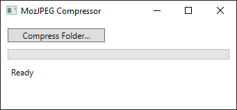

# MozJpegGui

> This is currently under active development and not yet ready for production use.

[MozJPEG](https://github.com/mozilla/mozjpeg) reduces file sizes of JPEG images while retaining quality and compatibility with the vast majority of the world's deployed decoders.

This is a simple GUI for MozJPEG.

## Features

* compress *.jpg files using MozJPEG with quality 75
* copy EXIF data from the original files
* use multiple cores to compress multiple files at once
* show progress

